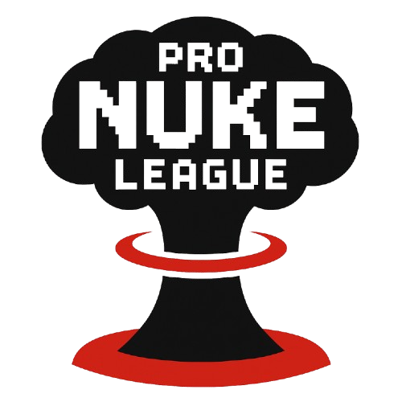

# � Pro Nuke League (PNL)

<div align="center">



**The First Fully Automated, Transparent Trading Competition on Solana**

[](https://pnl.best)
[](LICENSE)
[](https://solana.com)
[](https://github.com/pronukeleague/pnl)

</div>

---

## 🎯 What is Pro Nuke League?

**Pro Nuke League (PNL)** is a fully automated trading competition platform built on Solana for trenchers. Compete with other traders, showcase your PNL skills, and win SOL by get creator rewards — all powered by transparent, open-source code.

### ✨ Key Features

- 🎮 **Dual Join Methods**: Connect your wallet OR paste any Solana address to join
- 📝 **Custom Profiles**: Authenticated users can edit their name (2 changes per 24h limit)
- 📊 **Real-Time Leaderboard**: Live PNL tracking powered by Axiom API
-  **Wallet Security**: Industry-leading security practices with JWT session tokens ([learn more](https://pnl.best/security))
- 🤖 **Fully Automated**: No manual intervention — everything runs on schedule
- 🌐 **100% Open Source**: Complete transparency, audit our code anytime
- 🎯 **Token-Gated**: Requires 1,000,000 $PNL tokens to participate

---


---

## 🚀 How It Works

### For Participants

1. **Hold `$PNL` Tokens**  
   Own **1,000,000 $PNL** tokens in your Solana wallet to join

2. **Join the Competition** — Two Methods Available:

   **Method 1: Connect Wallet (Recommended)**
   - Connect your Phantom wallet
   - Choose a custom display name
   - Sign the authentication message
   - Instant access to edit your profile and stats
   - That's it! You're in for the current 24-hour season

   **Method 2: Paste Any Address**
   - Click "Paste Address" tab
   - Enter any Solana wallet address (your own or someone else's)
   - No wallet connection needed
   - Anonymous entry with auto-generated name (first 4 characters)
   - Perfect for:
     - Registering wallets you don't have access to right now
     - Adding friends/other traders to the competition
     - Bulk registrations
     - Using cold storage wallets

   > **Note**: Only wallets registered via Method 1 (wallet connect) can edit their name and access full profile features. Anonymous entries are read-only.

3. **Trade & Compete**  
   Your trading performance is tracked automatically:
   - Portfolio metrics updated every 5 minutes
   - Real-time PNL calculations
   - Live leaderboard rankings

4. **Win Prizes**  
   Top 3 traders are eligible for automated prize draws:
   - **Every hour**: One draw among Top 3
   - **Prize**: 10% of accumulated creator fees
   - **Winning Chances**: 
     - 🥇 1st Place: **55%**
     - 🥈 2nd Place: **30%**
     - 🥉 3rd Place: **15%**

### Automated Systems

#### 📈 PNL Updates (Every 5 Minutes)
```
Fetches portfolio data from Axiom API
├── Realized PNL (USD & SOL)
├── Trade counts (Buy/Sell)
├── Volume metrics (Bought/Sold)
└── PNL breakdown by percentage ranges
```

#### 💎 Creator Fees Collection (Every 15 Minutes)
```
Scans developer wallet for Solana tokens
├── Identifies tokens with creator fees available
├── Claims fees automatically
└── Accumulates SOL for prize pool
```

#### 🎁 Prize Distribution (Every Hour)
```
Checks accumulated prize pool (min 0.01 SOL)
├── Selects Top 3 traders by realized PNL
├── Weighted random selection (55/30/15%)
├── Sends 10% of pool to winner
├── Records draw in transparent history
└── Transaction visible on Solana Explorer
```

---

## 🔒 Security & Privacy

Pro Nuke League implements **industry-leading wallet security practices**:

- ✅ **Read-only wallet verification** — never asks for private keys
- ✅ **Signature-based authentication** — secure message signing
- ✅ **No transaction approvals** — platform never initiates transactions
- ✅ **Case-sensitive wallet handling** — preserves original addresses
- ✅ **Separate wallet storage** — normalized vs. original addresses
- ✅ **Security badge** — visual indicator of wallet connection safety

### 📖 Learn More About Our Security

We've created a comprehensive security guide covering:
- How wallet authentication works
- What data we store (and what we don't)
- Why you can trust Pro Nuke League
- Best practices for wallet security

**Read the full guide**: [Wallet Security Documentation](https://pnl.best/security)

---

## 🛠️ Tech Stack

### Frontend
- **Next.js 15** — React framework with app router
- **TypeScript** — Type-safe development
- **Tailwind CSS** — Utility-first styling
- **Solana Wallet Adapter** — Phantom & multi-wallet support

### Backend
- **Next.js API Routes** — Serverless backend
- **MongoDB + Mongoose** — Database with schemas
- **Node-Cron** — Automated task scheduling

### Blockchain
- **Solana Web3.js** — Blockchain interactions
- **SPL Token** — Token verification & transactions
- **Axiom API** — Portfolio metrics & trading data

### Automation
- **Cron Jobs** — Scheduled tasks (10min, 2hr intervals)
- **API Secret Protection** — Secured internal endpoints

---

## 📦 Installation & Setup

### Prerequisites

- Node.js 18+ 
- MongoDB instance (local or Atlas)
- Solana wallet with private key (for dev wallet)
- Axiom API cookies (for portfolio data)

### Quick Start

1. **Clone the repository**
   ```bash
   git clone https://github.com/pronukeleague/pnl.git
   cd pnl
   ```

2. **Install dependencies**
   ```bash
   npm install
   ```

3. **Configure environment variables**
   ```bash
   cp .env.example .env
   ```
   
   Edit `.env` with your configuration:
   - `MONGO` — MongoDB connection string
   - `OP_TOKEN_MINT` — Your $PNL token mint address
   - `DEV_PK` — Developer wallet private key (base58)
   - `API_SECRET` — Generate with: `node -e "console.log(require('crypto').randomBytes(32).toString('hex'))"`
   - `SHOULD_CLAIM_FEES` — Enable auto-claim (true/false)
   - `SHOULD_PERFORM_DRAWS` — Enable auto-draws (true/false)

4. **Setup Axiom cookies** (required for portfolio data)
   ```bash
   mkdir -p cookies
   # Add your Axiom cookies to cookies/axiom_cookies.json
   ```

5. **Run development server**
   ```bash
   npm run dev
   ```

   Open [http://localhost:3000](http://localhost:3000)

6. **Build for production**
   ```bash
   npm run build
   npm start
   ```

---

## 🤝 Contributing

We welcome contributions! This project is open source to promote transparency and community involvement.

### Ways to Contribute

- 🐛 **Report bugs** — Open an issue with detailed reproduction steps
- 💡 **Suggest features** — Share your ideas for improvements
- 🔧 **Submit PRs** — Fix bugs, add features, improve docs
- 📖 **Improve documentation** — Help others understand the platform
- 🔒 **Security audits** — Review code and report vulnerabilities

### Development Guidelines

1. Fork the repository
2. Create a feature branch (`git checkout -b feature/amazing-feature`)
3. Commit your changes (`git commit -m 'Add amazing feature'`)
4. Push to the branch (`git push origin feature/amazing-feature`)
5. Open a Pull Request

---

## 📄 License

This project is licensed under the **MIT License** — see the [LICENSE](LICENSE) file for details.

---

## 🔗 Links

- 🌐 **Website**: [pnl.best](https://pnl.best)
- 🐦 **Twitter/X**: [Follow us](https://x.com/pronukeleague)
- 💬 **Telegram**: [Join community](https://t.me/pronukeleague)
- 📚 **Security Docs**: [Wallet Security Guide](https://pnl.best/security)
- 🔍 **Token**: View $PNL on [To be launched](https://solscan.io)

---

## ⚠️ Disclaimer

This platform is for entertainment and educational purposes. Trading cryptocurrencies involves risk. Always do your own research (DYOR) and never trade with funds you can't afford to lose.

---

## 💖 Acknowledgments

Built with passion for the Solana community. Special thanks to:
- Solana Foundation
- Phantom Wallet team
- Pump.fun creators
- The amazing $PNL community

---

<div align="center">

**Made with ❤️ for the Solana ecosystem**

*Trade smart. Stay safe. Nuke profits.* �

</div>
